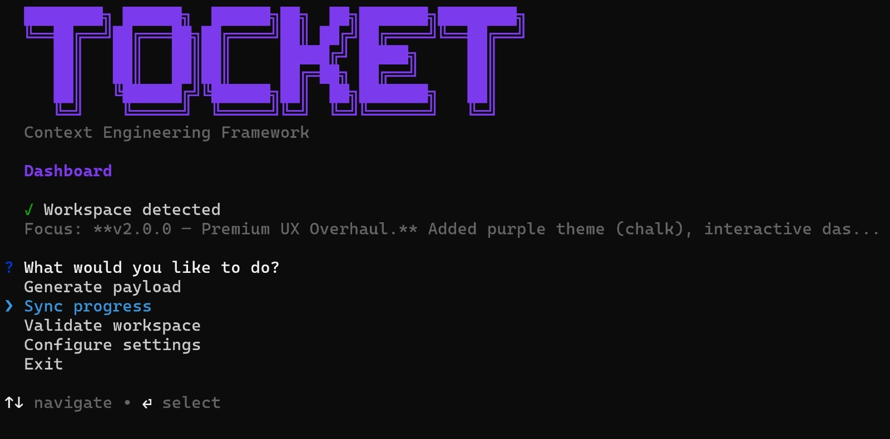

[](https://www.npmjs.com/package/@pedrocivita/tocket)
[](LICENSE)

# Tocket

**The Context Engineering Framework for Multi-Agent Workspaces**

AI agents forget everything between sessions. When multiple agents work on the same codebase, they re-read files, duplicate work, and make conflicting decisions. Tocket fixes this with **shared context files that any agent can read** — no vendor lock-in, no special integrations.

<p align="center">
  
</p>

## The idea in 30 seconds

Tocket is a file convention. It adds a `.context/` directory to your repo with markdown files that describe your project's current state, architecture, and progress. Any AI agent that can read files — Claude, Gemini, GPT, Cursor, Copilot — can pick up where the last session left off.

```
your-project/
  .context/
    activeContext.md      # What's happening right now
    systemPatterns.md     # How the codebase is organized
    techContext.md        # Stack and build tools
    productContext.md     # What the product is and why
    progress.md           # What's done, what's next
  TOCKET.md               # Protocol rules (for any AI)
  CLAUDE.md               # Executor agent config
  GEMINI.md               # Architect agent config
```

All files are plain markdown, committed to git, and readable by any tool.

## You don't need the CLI

The protocol is just files. You can adopt it manually:

1. Create a `.context/` directory with `activeContext.md` and `systemPatterns.md`
2. Add a [`TOCKET.md`](TOCKET.md) to your repo root
3. Tell your agents to read `.context/` before acting

The CLI automates the scaffolding, provides smart defaults, and adds quality-of-life tooling around the protocol.

## Quick Start

```bash
# Scaffold a new workspace (creates .context/, TOCKET.md, CLAUDE.md, GEMINI.md)
npx @pedrocivita/tocket init

# Or just the essentials (3 files)
npx @pedrocivita/tocket init --minimal

# Or open the interactive dashboard
npx @pedrocivita/tocket
```

That's it. Your repo now has a Memory Bank. Every AI session starts by reading `.context/activeContext.md`.

### Safe testing — use a branch

Tocket writes files to your repo, but you can try it risk-free on a branch:

```bash
git checkout -b test/tocket-setup
npx @pedrocivita/tocket init
git add .context/ TOCKET.md CLAUDE.md GEMINI.md .cursorrules
git commit -m "chore: scaffold Tocket workspace"

# Try it out — run some AI sessions, see if you like it
# Don't like it? Clean up:
npx @pedrocivita/tocket eject     # removes all Tocket files
# Or just delete the branch:
git checkout main && git branch -D test/tocket-setup
```

See the [Developer Guide](docs/DEVELOPERS_GUIDE.md) for detailed safe-testing workflows.

## Commands

| Command | What it does |
| --- | --- |
| `tocket` | Interactive dashboard with guided menu |
| `tocket init` | Scaffold `.context/`, `TOCKET.md`, and agent configs (auto-detects your stack) |
| `tocket generate` | Build structured payload XML (auto-fills scope from git) |
| `tocket sync` | Append session summary + git log to `.context/progress.md` |
| `tocket validate` | Check if the workspace has a valid Memory Bank |
| `tocket focus` | Update the Current Focus in `activeContext.md` |
| `tocket status` | Quick overview: workspace health, branch, focus, agents |
| `tocket doctor` | Deep workspace diagnostics (content health, git tracking, staleness) |
| `tocket lint` | Audit `.context/` content quality and suggest improvements |
| `tocket config` | Manage global settings (`~/.tocketrc.json`) |
| `tocket eject` | Remove all Tocket files (with confirmation) |

### CI-friendly flags

Every interactive command has flags for non-interactive use:

```bash
# Minimal init (3 files instead of 9)
tocket init --minimal --name myproject --description "My app" --force

# Sync without prompt
tocket sync --summary "Fixed auth bug and added tests"

# Generate to stdout or file instead of clipboard
tocket generate --to stdout
tocket generate --to payload.xml
```

## How it works

### Memory Bank

The `.context/` directory is the project's shared memory. Agents read it before acting and update it after completing work. Context lives in files, not in chat history.

| File | Purpose | Updated |
| --- | --- | --- |
| `activeContext.md` | Current focus, recent changes, open decisions | Every session |
| `systemPatterns.md` | Architecture patterns and conventions | When patterns change |
| `techContext.md` | Stack, build tools, critical rules | When stack changes |
| `productContext.md` | What the product is and why | Rarely |
| `progress.md` | Milestones and completed work | Per milestone |

### Triangulation

For complex tasks, Tocket separates planning from implementation:

```
Architect (any planning AI)         Executor (any coding AI)
     |                                   |
     |  1. Reads .context/               |
     |  2. Analyzes task                 |
     |  3. Generates <payload> XML       |
     |-------- structured handoff ------>|
     |                                   |  4. Reads .context/ + payload
     |                                   |  5. Implements tasks
     |                                   |  6. Updates .context/
     |<-------- status report -----------|
```

The Architect doesn't write code. The Executor doesn't make architecture decisions. The payload XML is the contract between them. For simple tasks, a single agent can fill both roles.

## Who is this for?

- Developers using **multi-agent setups** (Gemini + Claude, Cursor + Copilot, etc.)
- Teams that want **reproducible AI-assisted development** across sessions
- Anyone tired of re-explaining project context to AI every time they open a chat
- Open-source maintainers who want contributors' AI agents to follow project conventions

## How is Tocket different?

| Tool | What it does | How Tocket differs |
| --- | --- | --- |
| `.cursorrules` | Single-agent instructions for Cursor | Tocket defines _inter-agent_ protocol, not just single-agent rules |
| `CLAUDE.md` | Instructions for Claude Code | Tocket generates `CLAUDE.md` as part of a broader multi-agent system |
| `AGENTS.md` | Codex agent instructions | Same idea for one agent; Tocket coordinates multiple agents |
| Prompt templates | Static prompts for LLMs | Tocket's Memory Bank evolves with the project; payloads are structured, not freeform |

## Configuration

Set global defaults so you don't repeat yourself:

```bash
# Interactive setup
tocket config

# Or use flags (CI-friendly)
tocket config --author "Your Name" --priority medium --skills "core,lsp"

# View current config
tocket config --show
```

Config is stored at `~/.tocketrc.json` and pre-fills author, priority, and skills in all commands.

## Documentation

| Guide | Description |
| --- | --- |
| [Getting Started](docs/GETTING_STARTED.md) | Set up your first Tocket workspace in 5 minutes |
| [Developer Guide](docs/DEVELOPERS_GUIDE.md) | How to run the Tocket protocol safely in any project |
| [Tocket Rules](docs/TOCKET_RULES.md) | Complete reference for all protocol rules |
| [Protocol Spec](TOCKET.md) | The agent-agnostic protocol specification |

## Contributing

We welcome contributions! Please read our [Contributing Guide](CONTRIBUTING.md) to get started.

This project follows a [Code of Conduct](CODE_OF_CONDUCT.md).

## License

MIT
