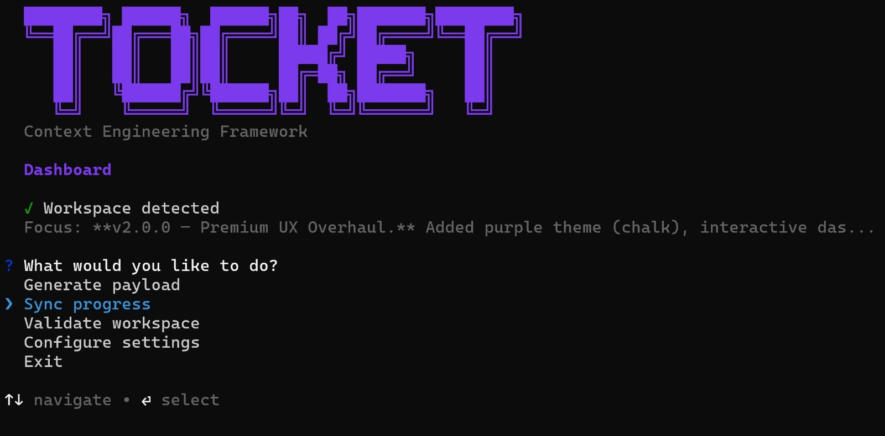

[](https://www.npmjs.com/package/@pedrocivita/tocket)
[](LICENSE)
[](https://tocket.ai)

# Tocket

**The Context Engineering Framework for Multi-Agent Workspaces**

AI agents forget everything between sessions. When multiple agents work on the same codebase, they re-read files, duplicate work, and make conflicting decisions. Tocket fixes this with **shared context files that any agent can read** — no vendor lock-in, no special integrations.

<p align="center">
  
</p>

## The idea in 30 seconds

Tocket is a file convention. It adds a `.context/` directory to your repo with markdown files that describe your project's current state, architecture, and progress. Any AI agent that can read files — Claude, Gemini, GPT, Cursor, Copilot — can pick up where the last session left off.

```
your-project/
  .context/
    activeContext.md      # What's happening right now
    systemPatterns.md     # How the codebase is organized
    techContext.md        # Stack and build tools
    productContext.md     # What the product is and why
    progress.md           # What's done, what's next
  TOCKET.md               # Protocol rules (agent-agnostic)
  CLAUDE.md               # Executor instructions (auto-detected per agent)
  GEMINI.md               # Architect instructions (auto-detected per agent)
```

All files are plain markdown, committed to git, and readable by any tool.

## You don't need the CLI

The protocol is just files. You can adopt it manually:

1. Create a `.context/` directory with `activeContext.md` and `systemPatterns.md`
2. Add a [`TOCKET.md`](TOCKET.md) to your repo root
3. Tell your agents to read `.context/` before acting

The CLI automates the scaffolding, provides smart defaults, and adds quality-of-life tooling around the protocol.

## Quick Start

```bash
# Scaffold a new workspace
npx @pedrocivita/tocket init

# Or just the essentials (3 files)
npx @pedrocivita/tocket init --minimal

# Configure your agents (optional — defaults to Claude Code + Gemini)
npx @pedrocivita/tocket config --architect "Gemini" --executor "Claude Code"

# Or open the interactive dashboard
npx @pedrocivita/tocket
```

That's it. Your repo now has a Memory Bank. Every AI session starts by reading `.context/activeContext.md`.

### Safe testing — use a branch

Tocket writes files to your repo, but you can try it risk-free on a branch:

```bash
git checkout -b test/tocket-setup
npx @pedrocivita/tocket init
git add .context/ TOCKET.md CLAUDE.md GEMINI.md
git commit -m "chore: scaffold Tocket workspace"

# Try it out — run some AI sessions, see if you like it
# Don't like it? Clean up:
npx @pedrocivita/tocket eject     # removes all Tocket files
# Or just delete the branch:
git checkout main && git branch -D test/tocket-setup
```

See the [Developer Guide](docs/DEVELOPERS_GUIDE.md) for detailed safe-testing workflows.

## Commands

| Command | What it does |
| --- | --- |
| `tocket` | Interactive dashboard with guided menu |
| `tocket init` | Scaffold `.context/`, `TOCKET.md`, and agent configs (auto-detects stack + agents) |
| `tocket generate` | Build structured payload XML (auto-fills scope from git, saves to `.tocket/`) |
| `tocket diff` | Compare payload targets against actual git changes (verify executor compliance) |
| `tocket sync` | Append session summary + git log to `.context/progress.md` |
| `tocket handoff` | Generate clipboard-ready context summary for a new agent conversation |
| `tocket validate` | Check if the workspace has a valid Memory Bank |
| `tocket focus` | Update the Current Focus in `activeContext.md` |
| `tocket status` | Quick overview: workspace health, branch, focus, agents |
| `tocket doctor` | Deep workspace diagnostics (content health, git tracking, staleness) |
| `tocket lint` | Audit `.context/` content quality and suggest improvements |
| `tocket config` | Manage global settings: agent roles, author, priority (`~/.tocketrc.json`) |
| `tocket suite status` | Print last AppMap run from `.context/appmaps/last-run.json` (exit 1 if failed, 2 if missing) |
| `tocket suite sync --from <path.json>` | Validate and copy a last-run.json into `.context/appmaps/`, regenerate `last-run.md` |
| `tocket suite init` | Scaffold empty `.context/appmaps/` index templates |
| `tocket suite triage` | Triage failed goals (Jev Choice, or heuristic stub without `TYPESAFE_API_KEY`) |
| `tocket suite loop` | Copy mapper AppMap + optional last-run into `.context/appmaps/` and triage |
| `tocket decide` | State + Choice handoff into `.context/decisions/` (Codila-style queues; does not run workers) |
| `tocket eject` | Remove all Tocket files (with confirmation) |

### CI-friendly flags

Every interactive command has flags for non-interactive use:

```bash
# Minimal init (3 files instead of 9)
tocket init --minimal --name myproject --description "My app" --force

# Sync without prompt
tocket sync --summary "Fixed auth bug and added tests"

# Generate to stdout or file instead of clipboard
tocket generate --to stdout
tocket generate --to payload.xml

# Verify executor followed the payload
tocket diff
tocket diff --json

# Handoff context to a new session
tocket handoff --to stdout

# AppMap last-run (file-first; does not execute maps)
tocket suite status
tocket suite sync --from path/to/last-run.json
tocket suite init
tocket suite triage --from path/to/last-run.json --dry-run
tocket suite loop --app tempestivita --map out/tempestivita.appmap.json --last-run last-run.json --dry-run

# Generic decision (Choice + optional Noul/Score). File handoff only.
tocket decide --state '{"goal":"docs"}' --choice next:research,write,review --dry-run
tocket decide --from path/to/state.json --noul needs_human_review --score relevance --shadow
tocket decide --from path/to/state.json --choice next:research,write,review --fork action --confidence-threshold 0.85
```

### Tempestivita loop (Oficina)

Three steps. Mapper is a sibling tool ([pedrocivita/appmap-mapper](https://github.com/pedrocivita/appmap-mapper)); Tocket does not vendor it.

```bash
# 1. Mapper — emit out/tempestivita.appmap.json (and optional smoke)
cd ../appmap-mapper
npx tsx src/cli.ts all --url https://tempestivita.civita.dev --smoke

# 2. Close the Memory Bank (map + last-run + triage stay under .context/)
cd ../tocket
tocket suite loop --app tempestivita \
  --mapper-out ../appmap-mapper/out \
  --last-run path/to/last-run.json \
  --dry-run

# 3. Read what loop wrote
tocket suite status
```

`--mapper-out` discovers `*.appmap.json` (prefers `<app>.appmap.json`). `--dry-run` uses the heuristic stub when `TYPESAFE_API_KEY` is missing. `--no-triage` copies files only.

### `tocket decide` (Codila-style file handoff)

`tocket decide` is Tocket's file-handoff cousin of [Codila's `chief.py` queues](https://x.com/0xCodila/status/2100984487802708306) (DataChaz 10-step summary). LLMs create, agents act, Jev decides the next move. The CLI writes a JSON that agents or other CLIs consume later.

```
State → Questions (batched) → Action (this file) → Verify (the consumer)
```

- Payload includes `choice`, `confidence`, `destination`, `state`, `fork`, and `executes: false`.
- Primitives: Choice + Noul now; `--score name` or `--score name:min,max` is optional. All flags batch into one System One request.
- Research/write route only when confidence >= 0.85 (override with `--confidence-threshold`). Below that, `destination` is `review` and `gated` is true.
- `--fork agent|model|tool|action|human` (default `action`). `--fork human` always reviews.
- `--dry-run` or no `TYPESAFE_API_KEY`: deterministic stub. With a key: live Jev. `--shadow`: live call, `semantics: log-only`.
- `tocket suite triage` is suite-specific (last-run failures). Suite loop still calls triage, not decide.

#### Boundaries (do / do not)

1. **Jev decides the next move.** LLMs create. Agents act. This command is the decision node.
2. **Primitives are Choice, Score, Noul.** Start with Choice + Noul. Score is optional. Do not send prose generation to Jev.
3. **Swap the decision node.** Do not rebuild the agent graph around Jev.
4. **Shared state + parallel questions + risk threshold + file queue.** Writes stay under `.context/decisions/<research|write|review>/`.
5. **Batch questions in one request.** Repeat `--choice` / `--noul` / `--score`; they share one System One call.
6. **Bounded forks only:** agent, model, tool, action, or human escalate. Not an open-ended graph.
7. **Whole-loop benchmark is out of scope** for this command (do that later, separately).
8. **Rank wide / read narrow.** Choice may list many options; the handoff stores the single `narrow` route (not every option).
9. **Reuse the loop:** State → Questions → Action (file) → Verify (consumer). Tocket is not the consumer.
10. **Keep Jev out of math, writing, and irreversible execution.** This CLI writes a file. It does not compute, draft, publish, or apply.

`executes` is always `false`. Workers (or humans) read the JSON. Tocket does not run them.

What lands in `.context/appmaps/`:

| File | Source |
| --- | --- |
| `tempestivita.appmap.json` | Mapper (or `--map`) copy |
| `last-run.json` / `last-run.md` | `--last-run` via the same v0 schema as `suite sync` |
| `tempestivita.triage.json` | Failed + low-confidence goals (unless `--no-triage`) |

Thin wrapper: `scripts/tempestivita-loop.sh` (sets `--app tempestivita` and `--mapper-out`).

## How it works

### Memory Bank

The `.context/` directory is the project's shared memory. Agents read it before acting and update it after completing work. Context lives in files, not in chat history.

| File | Purpose | Updated |
| --- | --- | --- |
| `activeContext.md` | Current focus, recent changes, open decisions | Every session |
| `systemPatterns.md` | Architecture patterns and conventions | When patterns change |
| `techContext.md` | Stack, build tools, critical rules | When stack changes |
| `productContext.md` | What the product is and why | Rarely |
| `progress.md` | Milestones and completed work | Per milestone |
| `appmaps/` | Optional AppMap index + map copy + last-run + triage | `tocket suite loop` / `sync` |
| `decisions/` | Choice/Noul handoff queues (`research/`, `write/`, `review/`) | `tocket decide` |

### Triangulation

For complex tasks, Tocket separates planning from implementation:

```
Architect (any planning AI)         Executor (any coding AI)
     |                                   |
     |  1. Reads .context/               |
     |  2. Analyzes task                 |
     |  3. Generates <payload> XML       |
     |-------- structured handoff ------>|
     |                                   |  4. Reads .context/ + payload
     |                                   |  5. Implements tasks
     |                                   |  6. Updates .context/
     |<-------- tocket diff report ------|
```

The Architect doesn't write code. The Executor doesn't make architecture decisions. The payload XML is the contract between them. After execution, `tocket diff` verifies compliance — did the Executor touch the right files? Are done criteria met? For simple tasks, a single agent can fill both roles.

### Closing the loop

```bash
# After the Executor finishes work:
tocket diff                    # compare payload targets vs actual git changes
tocket diff --json             # machine-readable output
tocket diff --since HEAD~3     # diff against a specific ref

# Starting a new session (next day, new chat):
tocket handoff                 # copies context summary to clipboard
tocket handoff --to stdout     # print instead
tocket handoff --commits 10    # include more history
tocket handoff --since 1d      # files modified in last day
```

## Who is this for?

- Developers using **multi-agent setups** (Gemini + Claude, Cursor + Copilot, etc.)
- Teams that want **reproducible AI-assisted development** across sessions
- Anyone tired of re-explaining project context to AI every time they open a chat
- Open-source maintainers who want contributors' AI agents to follow project conventions

## How is Tocket different?

| Tool | What it does | How Tocket differs |
| --- | --- | --- |
| `.cursorrules` | Single-agent instructions for Cursor | Tocket defines _inter-agent_ protocol, not just single-agent rules |
| `CLAUDE.md` | Instructions for Claude Code | Tocket generates agent configs as part of a broader multi-agent system |
| `AGENTS.md` | Codex agent instructions | Same idea for one agent; Tocket coordinates multiple agents |
| Prompt templates | Static prompts for LLMs | Tocket's Memory Bank evolves with the project; payloads are structured, not freeform |
| Vendor-locked tools | Tied to one provider | Tocket works with **any LLM/tool** — configure via `tocket config` |

## Configuration

Configure your preferred agents and defaults:

```bash
# Configure your agent roles
tocket config --architect "Gemini" --executor "Claude Code"

# Set payload defaults
tocket config --author "Your Name" --priority medium --skills "core,lsp"

# Or use the interactive setup (sections: Identity, Agent Roles, Payload Defaults)
tocket config

# View current config
tocket config --show
```

Config is stored at `~/.tocketrc.json`.

### Supported Agents

Tocket auto-generates the correct instruction file for each agent:

| Agent | Role | Generated File |
| --- | --- | --- |
| Claude Code | Executor | `CLAUDE.md` |
| Cursor | Executor | `.cursorrules` |
| Windsurf | Executor | `.windsurfrules` |
| Copilot | Executor | `.github/copilot-instructions.md` |
| Gemini | Architect | `GEMINI.md` |
| _(any other)_ | Executor | `EXECUTOR.md` |
| _(any other)_ | Architect | `ARCHITECT.md` |

Don't see your agent? It still works — unknown agents get generic files, and you can override any template via [`~/.tocket/templates/`](docs/DEVELOPERS_GUIDE.md).

## Documentation

| Guide | Description |
| --- | --- |
| [Getting Started](docs/GETTING_STARTED.md) | Set up your first Tocket workspace in 5 minutes |
| [Developer Guide](docs/DEVELOPERS_GUIDE.md) | How to run the Tocket protocol safely in any project |
| [Tocket Rules](docs/TOCKET_RULES.md) | Complete reference for all protocol rules |
| [Protocol Spec](TOCKET.md) | The agent-agnostic protocol specification |
| [Walkthrough](examples/walkthrough.md) | End-to-end payload exchange example |

## Contributing

We welcome contributions! Visit [tocket.ai](https://tocket.ai) for an overview of the framework, then read our [Contributing Guide](CONTRIBUTING.md) to get started.

This project follows a [Code of Conduct](CODE_OF_CONDUCT.md).

## License

MIT
